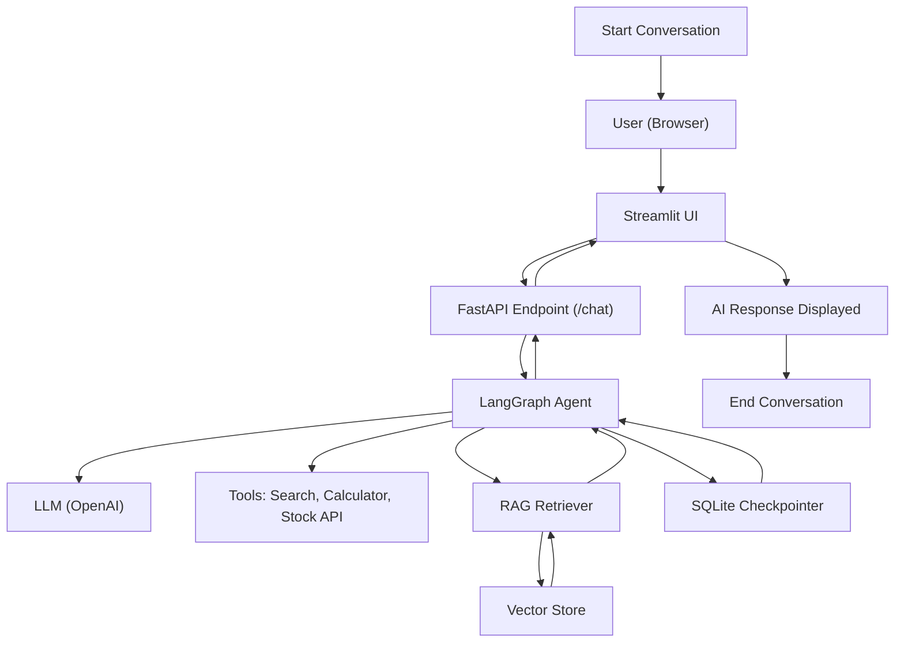

# LangGraph Agentic Chatbot (SQLite, Tools, Streaming)

A minimal, production-style agentic AI chatbot built using LangGraph, LangChain, and Streamlit.  
The system supports persistent chat history using SQLite, tool calling, conversation resume, and token-level streaming, RAG

---

## Features

- Persistent conversations using SQLite checkpointing
- Resume previous chats using thread IDs
- Real-time streaming responses
- Tool calling support
  - Web search
  - Calculator
  - Stock price lookup
- Agentic workflow powered by LangGraph
- Clean chat interface built with Streamlit
- Retrieval-Augmented Generation (RAG) support
  - Document-based question answering
  - Context retrieval from vector store
  - Grounded responses using external knowledge

---
## System Design (End-to-End Conversation Flow)

Each conversation is identified by a unique `thread_id`, allowing safe persistence, retrieval, and continuation of chats.

---

## Project Structure
<pre>
├── streamlit_frontend_streaming.py   <!-- Streaming chat UI -->
├── streamlit_frontend_database.py    <!-- Resume chat with SQLite -->
├── streamlit_frontend_tools.py       <!-- Tool-aware UI with status -->
│
├── langgraph_backend.py              <!-- Basic LangGraph chatbot -->
├── langgraph_database_backend.py     <!-- SQLite persistence backend -->
├── langgraph_tool_backend.py         <!-- Tool-enabled agent graph -->
│
├── chatbot.db                        <!-- SQLite database (auto-created) -->
├── requirements.txt
└── README.md
</pre>


---

## Tools Used

- DuckDuckGo Search for live web queries  
- Calculator tool for arithmetic operations  
- Stock price tool for fetching market data
- RAG retriever for fetching relevant document context

Tools are invoked automatically by the agent when required.

---

## Execution Flow

1. User submits a message
2. Request is processed by the LangGraph agent
3. Agent either responds directly or invokes a tool
4. Response is streamed token-by-token to the UI
5. Conversation state is saved in SQLite

---

## Run Locally

```bash
pip install -r requirements.txt
streamlit run streamlit_frontend_streaming.py
